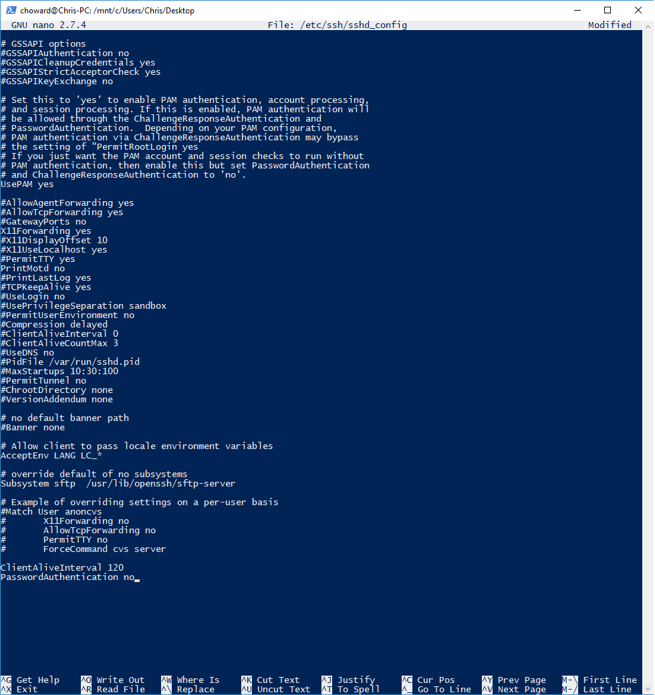

# Assignment 2

## Layer 8+

1. The 8th layer is the user of hte network stack, so layer 8+ issues are user errors, whether individual or collective (e.g. corporation or government). There is a right way to work within the PGP trust model, and a wrong way. While people in-the-right hold keysigning parties, or some other methods (like sharing your drivers license on a projector), in order to verify identity before key signing, some do not take these precautions, thus a malicious actor could get her key signed by someone trusted, and become more trusted, weakening the overall system. In terms of standoff biometry, organizations and governments collect biometric data en masse, in aggregate, whether intentional or not, and then fail to manage it securely, putting many at risk (an understatement).

2. The DARKLY server has privileges access to sensors (and perceptual data) while the (untrusted) app is unprivileged and only accesses data through DARKLY, as raw inputs are replaced by opaque references. DARKLY helps to secure the accessible data by applying access controls and algorithmic transformations, liek sketching, all while the user is given some power in choosing the power of the algorithm, through the trusted GUI—even though this can be dangerous.

## Simple Auditing

1. Set up a VPS running Debian on DigitalOcean:
*You will have the link*

2. Disable password authentication, and use an SSH key to access the server with a new account (not root):


3. On your VPS, install ufw, and use it to ensure that your server drops all traffic that is not an SSH session from your current IP address, or a web request from 127.0.0.1 on port 8080:


4. Install apache2. Edit the file /var/www/html/index.html to contain exactly the string 'DOWN WITH CYBERCRUD': *You will have the link*

## Tor

### Onion Proxy

Set up a python script called ```tor_getinfo.py``` that uses Stem to get information about your Tor connections:

```
from stem import CircStatus
from stem import CircPurpose
from stem import Signal
from stem.control import Controller

#Connect to control socket on TOR with specified port number
with Controller.from_port(port = 9051) as controller:
    controller.authenticate('16:E0BD65E652CA0F2A60283C691B131B3ED08BA824F10AA484AB6EEE71CC')
    controller.signal(Signal.NEWNYM)

    #Get list of active circuits
    for circuit in controller.get_circuits():

        #Filter circuit status since FAILED/CLOSED are not of interest. Same for purpose being general
        if circuit.purpose == CircPurpose.GENERAL and circuit.status == CircStatus.BUILT:

            #List tuples of the node fingerprint, nickname, and IP address and print them to CL
            relay_fingerprints = [(desc.fingerprint, desc.nickname, desc.address) for desc in controller.get_network_statuses()]
            for node in relay_fingerprints:
                try:
                  print(node[0], node[1], node[2])
                except Exception as exc:
                  print('%s => %s' % (node, exc))

#Some coding assistance from https://stem.torproject.org/tutorials/to_russia_with_love.html
```

1. List the nodes used, with the IP-address and the fingerprint for each open Tor connection:


2. Use the GeoIP Database to find the locations of your Tor nodes:


The latter accessed through ```cat /usr/share/tor/geoip/```.

### Specifying Parts of the Circuit

Defining guard and exit nodes by fingerprint:


1. List the nodes used, with the IP-address and the fingerprint for each open Tor connection and use the GeoIP Database to find the location of your nodes:

2. A strict selection of the Tor exit and entry nodes influences the anonymity of the connection by making it easier to conduct traffic and correlation analysis. However, it can also reduce the chances of using a node or set of nodes that are under the control of adversaries.

3. Is it possible to exclude nodes? When should this be done?

### Tor Bridges

1. Get a bridge that you can use to connect to the Tor network and give its IP, port, and fingerprint. How did you get these pieces of information? What are other methods to get a bridge?

2. In which situations is the application of bridges useful? Does the method to get a bridge that you chose before work in such situations?

### Set Up a Tor Hidden Service

1. Using your VPS, install tor, and set up a hidden service using the tor documentation. On your *local* computer, use the tor browser to visit your site (the address is found in $HOME/hidden_service/hostname). Turn in the onion address for your working hidden service in a file called 'hidden_service_address'.
 ```4xndivyuzsy44a7w.onion```
 
2. How is the service hidden, i.e., why can users not reveal the location of the service (in the network) and still use it? The Tor protocol picks 3 onion routers at random, builds circuits to them, treating them as introduction (or contact) points; since this is a circuit, there is no direct connection, so no IP addresses are shared, just public keys. These public keys work toward "shaking hands" at a rendezvous point. If the handshake happens, the rendezvous point connects Alice's and Bob's circuits, and then they can communicate anonymously.

3. Is there a way to still reveal information about the operators or the locations of a hidden service? There are many ways that important information may be revealed; looking at my hidden service's logs, there is information like browser and operating system. Keys can be compromised, correlational attacks can be carried out, there can be hostile code, and hostile ORs can be listed.

4. Can you distinguish between different users? Would this be different if your service was not a hidden service (and still accessed via Tor)? Looking at just the Tor connections, I cannot distinguish different users by eye, but it can be done. Without hidden services, I'm sure I can; the Tor browser alone is not that protective.
